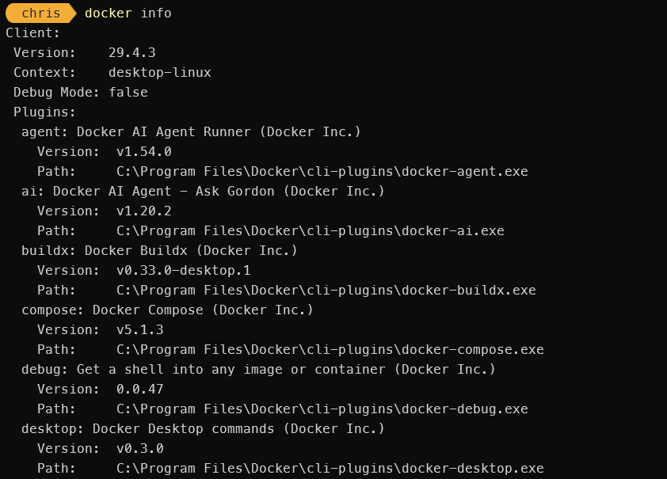

## Step 1 - Docker Desktop

Install [Docker Desktop](/notes/setup/2026-02-13-install-cuda-wsl/) and ensure it is running. Run `docker info` to verify it is installed and working.



---

## Step 2 - Install the VSCode Extension

Search for "Dev Containers" in the VSCode extension marketplace. Ensure you install the version published by Microsoft.


---

## Step 3 - Dev Container Configuration

Create a directory named `.devcontainer` in the root of your project. Inside this directory, create a file named `devcontainer.json` with the following content:

```json
{
  "name": "My Dev Container",
  "build": {
    "dockerFile": "Dockerfile"
},
  "extensions": [
    "ms-python.python",
    "ms-toolsai.jupyter"
  ],
  "settings": {
    "python.pythonPath": "/usr/local/bin/python"
  }
}
```

*See [Dev Container metadata reference](https://containers.dev/implementors/json_reference/) for more configuration options.*


With this you can create a `Dockerfile` in the same directory to specify the environment you want. For example:

```Dockerfile
FROM python:3.9-slim

RUN apt-get update && apt-get install -y \
    build-essential \
    curl \
    && rm -rf /var/lib/apt/lists/*

CMD ["python3"]
# or bash, or whatever command you want to run when the container starts
```

*You can also use a compose file if your project requires multiple services - see [Create a Dev Container](https://code.visualstudio.com/docs/devcontainers/create-dev-container).*

If you do not want to create a custom Dockerfile you can specify an image directly in the `devcontainer.json` using the `image` property instead of `dockerFile`.

---

## Step 4 - Reopen in Container

From here you can open the command palette (Ctrl+Shift+P) and select "Dev Containers: Reopen in Container". VSCode will then build the container based on your configuration and reopen the project inside the container.

---

## Special Note

**Treat Dev Containers as untrusted code execution**

Dev Containers are powerful but you should be careful when opening projects from people you don’t fully trust. A Dev Container configuration can automatically run commands during setup and startup, which means opening a repository can execute code on your machine through Docker.

Make sure to read the `devcontainer.json` and any associated Dockerfiles before opening a project in a container. If you are unsure about the source of the code, it’s safer to open the project without the container or in a sandboxed environment.

---

## Resources
- [Introduction to dev containers](https://docs.github.com/en/codespaces/setting-up-your-project-for-codespaces/adding-a-dev-container-configuration/introduction-to-dev-containers)
- [Dev Container metadata reference](https://containers.dev/implementors/json_reference/)
- [Create a Dev Container](https://code.visualstudio.com/docs/devcontainers/create-dev-container)
